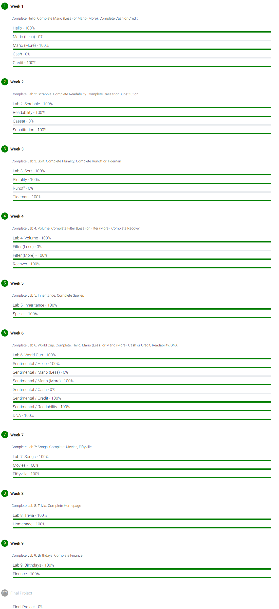

# Summary

This is a course for CS beginners. I've completed several embedded projects with C before the course, also I've been learning python through half of [this blog](https://www.liaoxuefeng.com/wiki/1016959663602400).

Thinking as a review, the course surprised me. The C part greatly deepened my understanding of the language. Moreover, the Web application part opened a new world for me. Recommended.

The course took me three weeks in total. Apart from the relaxing time, it's about a hundred hours, which is neither short nor quite long, compared with my steam gaming hours. The feeling of study is pretty well.

# Snippets&Review

## Week0

Though scratch is the starting point of the course, skipping it won't affect further study much. Thus students with programming basics could skip this part like me.

## Week1

The digit's algorithm in credit is quite interesting, using the bit operating technique of integer.

## Week2

The 3 functions in readability walk through the text three times, resulting in an inefficient part of the code. But the framework was given the 3 functions in it, probably for check50 and simpler design.

## Week3

Plurality properly introduced the concept of voting.

As a student unfamiliar with voting, Tideman's principle is interesting.

As a student unfamiliar with data structure, the 2-D data structure like matrix and graph, along with the adjacency matrix is interesting.

Besides the comprehension of the problem's description and the coding framework, the hardest part of the code should be judging whether there's a loop in the graph. This is a brilliant application of the recursive thinking taught. The guidance from lectures and problem is perfect, which make it a great problem in this course.

Code thoughts: To find whether there's a route from a node to a given node, one can search every next node current node pointing to, and recurse until an end node or finding the route.

## Week4

Filter and volume are image and audio processing respectively. Having done quite a few similar labs with Matlab and FPGA, I'm familiar with the principles.

There are lots of tedious repetitions in the code which may require some improvement. The cumbersome in this problem might be emphasizing the benefits of python.

Recover is an application of data recovery which is pretty interesting.

The problem set contains projects with multiple C files, helpful to deepen the understanding of library, linking and compiling.

## Week5

Inheritance is a simulation of blood type inheritance and an application of recurtion, but not as fun as tideman.

Speller has some difficulty as the last problem in C. The framework given is a hash tree based on prefix alphas. A trie might offer a faster speed.

Code thoughts: Map the dictionary based on the first several characters. The mapping function is the order in the alphabet. The single quote should be taken into consideration.

There's not much improvement when changing from two characters prefix to three, let alone four. The final total running time is still 0.1 sec slower than the staff's solution.

The texts provided are all very classic, including a selection from > Dream of the Red Chamber.